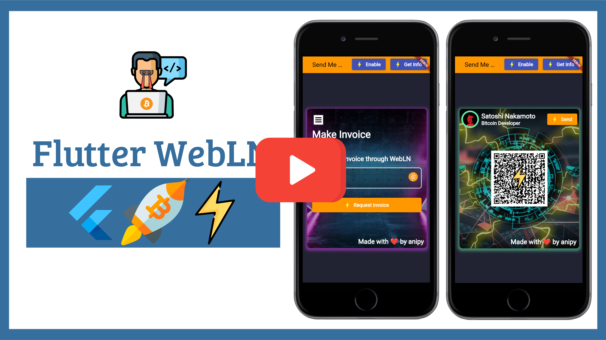

## 🌟 **Open to Work** 🌟

Hello there! 👋

If you or your team are working on projects similar to the ones you find in this GitHub repository, I'm open to collaboration and excited to contribute my skills as a developer.

I have a deep passion for developing mobile apps, and I'm eager to work on innovative and challenging tasks. You can find my resume [here](https://drive.google.com/file/d/12qOmW2rQDDKn3IwK25qbcDcJSc0GpV1W/view), which provides more details about my experience and qualifications.

If you see potential for collaboration or would like to discuss how I can contribute to your projects, please feel free to reach out to me at [aaa.software.dev@gmail.com](mailto:aaa.software.dev@gmail.com?subject=Job%20Opportunity&body=Hello,%0D%0A%0D%0AI%20am%20contacting%20you%20in%20response%20to%20your%20website%20and%20to%20inquire%20about%20your%20availability%20for%20a%20potential%20job%20opportunity%20as%20a%20software%20developer.%0D%0A%0D%0APlease%20let%20me%20know%20if%20you%20are%20interested%20in%20discussing%20further.%0D%0A%0D%0AThank%20you,%0D%0A[Your%20Name]%0D%0A[Your%20Contact%20Information]).

Thank you for taking the time to visit my repository. I look forward to potential opportunities to work together and create something amazing!

---

    

<h3 align="center">This repository contains all the code written in the <a href="https://www.youtube.com/watch?v=sWkkAPuF6eg&list=PLke5uKXgh5l4cKfnONRxzsN_rszx-5nOd" target="_blank">Bitcoin Lightning Web Application Development course using Flutter Web</a>.</h3>

---

In this course you will learn Bitcoin Lightning Web Application Development using Flutter framework and Flutter WebLN package.

This course is divided into multiple sections and video lectures which includes:

- Lecture 0: Course Pre-requisite (Flutter Web and - WebLN Standard)
- Lecture 1: Setting WebLN Providers
- Lecture 2: Setting up Project Structure

- Lecture 3: Component Setup: CustomAppBar, InvoiceScreen and PaymentScreen
- Lecture 4: Component Setup: Responsive Layout
- Lecture 5: Component Setup: InvoiceCard and PaymentCard Initial Container
- Lecture 6: Component Setup: InvoiceCard and PaymentCard (Dark Overlay)
- Lecture 7: Component Setup: CustomTextField and CustomButton
- Lecture 8: Component Setup: Invoice Card Form
- Lecture 9: Component Setup: Payment Card (Circle Image and Card Header)
- Lecture 10: Component Setup: Payment Card Custom QR Code
- Lecture 11: Component Setup: Creating Card Footer
- Lecture 12: Component Setup: Summary

- Lecture 13: Models Setup: Get Info and Node model
- Lecture 14: Service Setup: WebLN Service Setup, Implementing Enable and Get Info Method.
- Lecture 15: Models Setup: Invoice and Payment Model

- Lecture 16: Lightning Network Specifications

- Lecture 17: Service Setup: WebLN Service Setup, Implementing Make Invoice Method
- Lecture 18: Service Setup: WebLN Service Setup, Implementing Send Payment Method

- Lecture 19: Declarative Navigation with Navigator 2.0
- Lecture 20: Declarative Navigation with Navigator 2.0 (Using the App State Manager)
- Lecture 21: Declarative Navigation with Navigator 2.0 (Creating the router)
- Lecture 22: Declarative Navigation with Navigator 2.0 (Handling pop events)
- Lecture 23: Declarative Navigation with Navigator 2.0 (Adding state listeners)
- Lecture 24: Declarative Navigation with Navigator 2.0 (Using the app router)
- Lecture 25: Declarative Navigation with Navigator 2.0 (SendSats Navigation Pages)
- Lecture 26: Declarative Navigation with Navigator 2.0 (Splash Screen Setup)
- Lecture 27: Declarative Navigation with Navigator 2.0 (WebLNService defining state fields and notifier methods)
- Lecture 28: Declarative Navigation with Navigator 2.0 (Displaying the Invoice Screen)
- Lecture 29: Declarative Navigation with Navigator 2.0 (Transitioning from InvoiceScreen to PaymentScreen)
- Lecture 30: Declarative Navigation with Navigator 2.0 (Handling Back Button)

- Lecture 31: Dynamic Web URLs (Introduction and Overview of SendSats path)
- Lecture 32: Dynamic Web URLs (Creating a navigation state object)
- Lecture 33: Dynamic Web URLs (Converting a URL string to an AppLink)
- Lecture 34: Dynamic Web URLs (Converting an AppLink to a URL string)
- Lecture 35: Dynamic Web URLs (Creating a route information parser)
- Lecture 36: Dynamic Web URLs (Connecting the parser to the app router)
- Lecture 37: Dynamic Web URLs (Converting a URL to an app state)
- Lecture 38: Dynamic Web URLs (Converting the app state to a URL)

- Lecture 39: Setting Toast 
- Lecture 40: Invoice Card wallet check ternary TODO + Payment Card wallet check ternary
- Lecture 41: Confetti Setup in Payment Screen

- Lecture 42: Deploying on Web
- Lecture 43: Fixing 404 Error

- Lecture 44: Testing: Getting free Bitcoin over the Lightning network for testing

- Lecture 45: Final Note: Where to go from here?

- Bonus Lectures…………………………

# Screenshot

     <h2><b>Invoice Card</b></h2> 
    

     <h2><b>Payment Card</b></h2> 
    

Instructor: Aniket Ambore (aka. Anipy)

   - Github: https://github.com/aniketambore
   - Twitter: https://twitter.com/Anipy1
   - LinkedIn: https://www.linkedin.com/in/aniketambore/

## Contributing:

 - Fork it!
 - Create your feature branch: `git checkout -b my-new-feature`
 - Commit your changes: `git commit -am 'Add some feature'`
 - Push to the branch: `git push origin my-new-feature`
 - Submit a pull request.

<h3 align="center">Show some ❤ and star the repo to support the project</h3>
